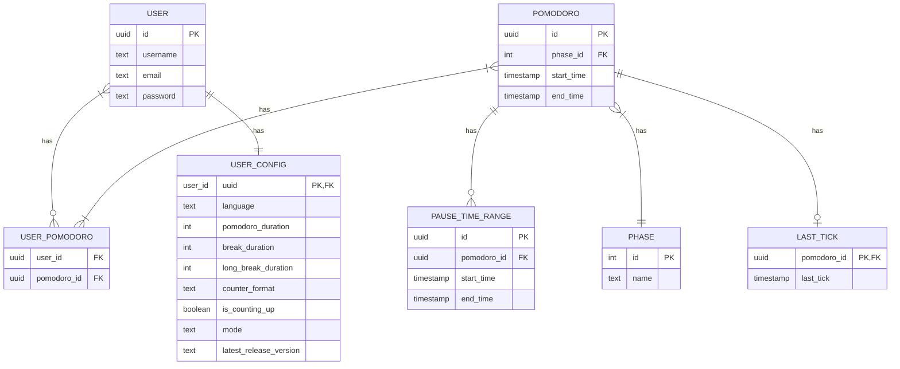

# Database E-R Diagram

```mermaid
erDiagram
    USER {
        uuid id  PK
        text username
        text email
        text password
    }
    POMODORO {
        uuid id PK
        int phase_id FK
        timestamp start_time
        timestamp end_time

    }
    PAUSE_TIME_RANGE {
        uuid id PK
        uuid pomodoro_id FK
        timestamp start_time
        timestamp end_time

    }

    USER_POMODORO {
        uuid user_id FK
        uuid pomodoro_id FK
    }

    PHASE{
        int id PK
        text name
    }

    LAST_TICK {
        uuid pomodoro_id PK, FK
        timestamp last_tick

    }

    USER_CONFIG{
        user_id uuid PK,FK
        text language
        int pomodoro_duration
        int break_duration
        int long_break_duration
        text counter_format
        boolean is_counting_up
        text mode
        text latest_release_version

    }

    POMODORO ||--o{ PAUSE_TIME_RANGE : has
    USER |{--o{ USER_POMODORO : has
    USER ||--|| USER_CONFIG: has
    POMODORO |{--|{ USER_POMODORO : has
    POMODORO |{--|| PHASE : has
    POMODORO ||--o| LAST_TICK : has
```
